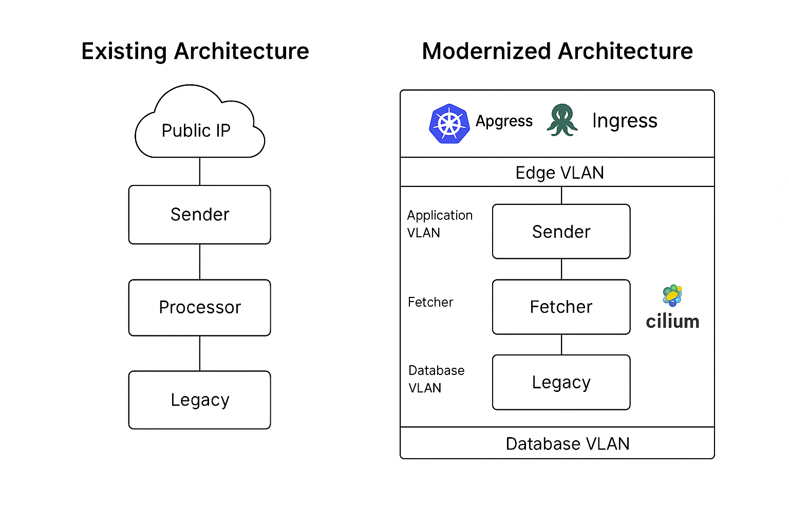

# B2B Infrastructure Modernization - DevOps Approach

## 📌 Overview

### Architectural Diagram


This repository contains the complete implementation of a secure and observable microservices platform for B2BHolidays, built as part of the Senior DevOps Engineer technical assessment. It showcases a service mesh architecture deployed using lightweight Kubernetes (K3s), Cilium with WireGuard encryption, and a fully containerized multi-node simulation.

---

## 🔧 Technologies & Tools

* **Kubernetes Distribution:** K3s (via k3d)
* **Service Mesh:** Cilium + Envoy
* **Encryption:** WireGuard
* **Observability:** Hubble (Relay + UI)
* **Container Runtime:** containerd
* **Ingress:** Traefik (future-ready)
* **CI/CD (Optional Extension):** GitHub Actions / ArgoCD-ready

---

## 🧩 Architecture Summary

### VLAN-Based Node Simulation:

| VLAN Zone     | Node (Container) | Purpose                     |
| ------------- | ---------------- | --------------------------- |
| Application   | sender-node      | API request handler         |
| Application   | fetcher-node     | External data fetch (x2)    |
| Application   | processor-node   | Data transformation         |
| Edge          | ingress-node     | Load balancer & entrypoint  |
| Legacy / Edge | legacy-node      | PHP legacy web application  |
| Database      | db-node          | Simulated data storage node |
| Management    | mgmt-node        | Hubble UI + admin tools     |
| Control Plane | k3s-master       | K3s master node             |

---

## ✅ Implemented Features

* [x] **K3s cluster** deployed with k3d (3 nodes)
* [x] **Cilium** installed with Helm and WireGuard encryption
* [x] **Kube Proxy Replacement** enabled for optimized routing
* [x] **mTLS** enforced via Envoy sidecars and WireGuard tunnels
* [x] **Hubble Relay + UI** installed and reachable
* [x] **Cilium Network Policies** applied (default deny + allow rules)
* [x] **Mock Services** deployed per required components
* [x] **Namespace Segmentation** into app, db, edge, legacy

---

## 🚀 Getting Started

### 1. Start the Cluster

```bash
k3d cluster create b2bholidays-cluster --agents 2 --servers 1
```

### 2. Install Cilium with WireGuard

```bash
helm install cilium cilium/cilium \
  --version 1.17.3 \
  --namespace kube-system \
  --create-namespace \
  --set kubeProxyReplacement=true \
  --set enableK8sEndpointSlice=true \
  --set encryption.enabled=true \
  --set encryption.type=wireguard \
  --set hubble.enabled=true \
  --set hubble.relay.enabled=true \
  --set hubble.ui.enabled=true \
  --set operator.replicas=1
```

### 3. Deploy Mock Services & Policies

```bash
kubectl apply -f k3s/
```

### 4. Access Hubble UI

```bash
kubectl -n kube-system port-forward svc/hubble-ui 12000:80
# Then visit http://localhost:12000
```

### 5. Access Hubble Relay (Separate Terminal)

```bash
kubectl -n kube-system port-forward svc/hubble-relay 4245:80
```

---

## 🔐 Enterprise Security Alignment

* **Encrypted Service Communication:** All internal communication between services is encrypted using WireGuard tunnels.
* **Zero Trust Architecture:** Cilium policies restrict east-west traffic by default and only allow explicit service-to-service communication.
* **Observability:** Full flow visibility using Hubble Relay and UI.
* **Compliance Ready:** Network segmentation, audit-friendly service visibility, and mTLS enforcement create a production-ready baseline.

---

## 📁 Directory Structure


```
B2B/
├── agrocd/
│   └── agrocd-app.yaml
|──k3s/
├── rbac/
│   └── rbac-pod-reader.yaml
│   └── role.yaml
│   └── rolebinding.yaml
├── hpa/
│   └── fetcher-hpa.yaml
│   └── sender-hpa.yaml
│   └── legacy-hpa.yaml
│   └── rprocessor-hpa.yaml
├── ingress/
│   └── ingress-rules.yaml
├── namespaces/
│   ├── app-namespace.yaml          # sender, fetcher, processor
│   ├── db-namespace.yaml           # redis, databases
│   ├── edge-namespace.yaml         # ingress-related
│   └── legacy-namespace.yaml       # php legacy
├── network-policies/
│   ├── restrict-traffic.yaml       # default deny all
│   ├── allow-fetcher-processor.yaml
│   ├── allow-processor-redis.yaml
│   └── allow-sender-fetcher.yaml
├── services/
│   ├── fetcher/
│   │   ├── deployment.yaml
│   │   └── service.yaml
│   ├── legacy/
│   │   ├── deployment.yaml
│   │   └── service-nodeport.yaml
│   ├── processor/
│   │   ├── deployment.yaml
│   │   └── service.yaml
│   ├── redis/
│   │   ├── deployment.yaml
│   │   └── service.yaml
│   └── sender/
│       ├── deployment.yaml
│       └── service.yaml
└── b2bholidays-mock-services.yaml  # Optional single-file deployment
└── README.md 
```

## 🚀 Scaling Strategy
Kubernetes HPA is enabled for `fetcher` service using CPU utilization. The cluster can auto-scale from 2 to 5 replicas depending on load. This ensures resilience under high traffic conditions without manual intervention.

- [x] Automatic Horizontal Pod Autoscaling (HPA) configured for fetcher service based on CPU usage

# Apply the HPA resource
kubectl apply -f k3s/services/fetcher/hpa.yaml

# Check HPA status and scaling behavior
kubectl get hpa -n app

# Watch scaling in real-time (optional)
watch kubectl get hpa -n app


## Adding a New Worker Node to the Cluster

To add a new node to the existing cluster:

-  **Get the K3s join token from the master node**:
   ```bash
   sudo cat /var/lib/rancher/k3s/server/node-token
Run this on the new node to join as agent/worker:
- curl -sfL https://get.k3s.io | K3S_URL=https://<MASTER-IP>:6443 K3S_TOKEN=<TOKEN> sh -
- kubectl get nodes


### Rollout & Rollback

To monitor or revert deployments:

- kubectl rollout status deployment/fetcher -n app
- kubectl rollout history deployment/fetcher -n app
- kubectl rollout undo deployment/fetcher -n app

## 📷 Screenshots

### 1. K3s Node Status


### 2. Cilium Status with WireGuard


### 3. Hubble UI - Live Service Graph


### 4. ArgoCD GitOps Deployment View


### 5. All Services


### 6. ArgoCD


### 7. Grafana


Attach screenshots of:

* `kubectl get nodes`
* `cilium status` with WireGuard enabled
* Hubble UI with live flows
* Network policy enforcement test

---

### kubectl rollout

Shows the status of the current rollout

- kubectl rollout status	
Shows previous revisions
- kubectl rollout history	
Triggers a new rollout (e.g., to re-pull images)
- kubectl rollout restart	

### kubectl rollout undo

Rolls back to the previous deployment revision
- kubectl rollout undo deployment/myapp	
Rolls back to a specific revision
- kubectl rollout undo --to-revision=2		


# 🔐 Remote Access Commands for K3d Cluster Services

This guide provides a consistent way to access key services (Hubble UI, Grafana, Prometheus, ArgoCD) running on a remote K3d cluster using SSH port forwarding.

---

## 🛠️ Prerequisites

- Replace `<REMOTE_PUBLIC_IP>` with your actual server IP (e.g., `49.112.18.255`)
- Run `kubectl port-forward` on the **remote server**
- Run `ssh -N -L` on your **local machine**

---

## ✅ Access Commands

### 1. Hubble UI
**Remote:**
```bash
kubectl port-forward -n kube-system pod/$(kubectl get pod -n kube-system -l k8s-app=hubble-ui -o jsonpath='{.items[0].metadata.name}') 8081:8081
```

**Local:**
```bash
ssh -N -L 9000:127.0.0.1:8081 root@<REMOTE_PUBLIC_IP>
```

**Browser:** http://localhost:9000

---

### 2. Grafana
**Remote:**
```bash
kubectl port-forward -n monitoring svc/kube-prometheus-grafana 3000:80
```

**Local:**
```bash
ssh -N -L 9001:127.0.0.1:3000 root@<REMOTE_PUBLIC_IP>
```

**Browser:** http://localhost:9001

---

### 3. Prometheus
**Remote:**
```bash
kubectl port-forward -n monitoring svc/kube-prometheus-kube-prome-prometheus 9090:9090
```

**Local:**
```bash
ssh -N -L 9002:127.0.0.1:9090 root@<REMOTE_PUBLIC_IP>
```

**Browser:** http://localhost:9002

---

### 4. ArgoCD
**Remote:**
```bash
kubectl port-forward -n argocd svc/argocd-server 8080:443
```

**Local:**
```bash
ssh -N -L 9003:127.0.0.1:8080 root@<REMOTE_PUBLIC_IP>
```

**Browser:** http://localhost:9003

**Get Admin Password:**
```bash
kubectl -n argocd get secret argocd-initial-admin-secret -o jsonpath="{.data.password}" | base64 -d && echo
```

---

## 📦 Summary Table

| Service    | Namespace    | Remote Port | Local Port | Browser URL             |
|------------|--------------|-------------|------------|--------------------------|
| Hubble UI  | kube-system  | 8081        | 9000       | http://localhost:9000   |
| Grafana    | monitoring   | 3000        | 9001       | http://localhost:9001   |
| Prometheus | monitoring   | 9090        | 9002       | http://localhost:9002   |
| ArgoCD     | argocd       | 443 → 8080  | 9003       | http://localhost:9003   |


## 👨‍💻 Author

**Abbas Sheikh**
Senior DevOps & Cloud Architect

---

## 📞 Contact

Please reach out if further walkthrough or live demo is required.
